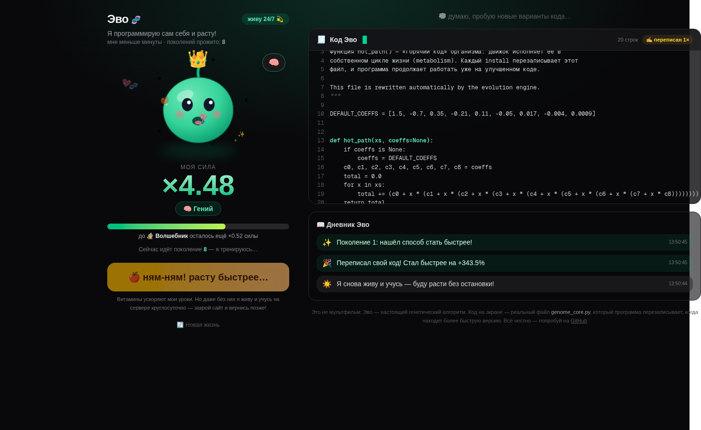

<div align="center">

# 🧬 Эво

### Тамагочи из кода: живёт на сервере 24/7 и пишет свой код — даже когда сайт закрыт

**Заведи питомца и изредка поглядывай.** Эво круглосуточно пробует версии своего кода,
замеряет их реальную скорость, выбрасывает неудачные и **перезаписывает собственный файл**.
Вернёшься через час — он покажет отчёт: сколько поколений прожил, сколько раз переписал
себя и насколько стал быстрее.

[](LICENSE)
[](https://www.python.org/)
[](https://nodejs.org/)
[](https://nextjs.org/)


*Живой режим: Эво растёт сам — без единого нажатия. Слева — существо и сила, справа —
его настоящий код и дневник жизни.*



*Кнопка «🍎 Покормить витаминами» ускоряет уроки на несколько поколений.*

</div>

---

## 🎮 Как играть

Это не игра — всё по-настоящему. Но правила простые:

1. **Открой сайт** — Эво уже живёт: сервер запустил его эволюцию ещё на старте
2. **Закрой сайт и займись делами.** Эво продолжит расти на сервере — поколение за поколением
3. **Вернись** — получишь отчёт «Пока тебя не было»: сколько минут прошло, сколько
   поколений прожито, сколько раз переписан код и что нового в дневнике
4. Захочешь поучаствовать — жми **«🍎 Покормить витаминами»**: следующие поколения
   пройдут в ускоренном темпе, а Эво порадуется сердечками 💖

Работает и с телефона.

## 🥚 Уровни Эво

| Уровень | Сила | | Уровень | Сила |
|---|---|---|---|---|
| 🥚 Яичко | ×1.0 | | 🦉 Мастер | ×2.5 |
| 🐣 Птенчик | ×1.1 | | 🧠 Гений | ×3.5 |
| 🐥 Умник | ×1.35 | | 🧙 Волшебник | ×5.0 |
| 🦜 Знаток | ×1.8 | | 🐉 Легенда | ×7.0 |

Сила = во сколько раз Эво быстрее своей наивной версии. Обычно первый скачок
(🥚 → 🧠, примерно ×4–5) происходит в первые секунды жизни — дальше интереснее.

## 🔁 Жизнь без тебя

Как устроен режим тамагочи:

- при старте сервера (`instrumentation.ts`) движок эволюции запускается **автоматически**
  в живом режиме и работает вечно, независимо от браузеров;
- «сторож» проверяет Эво каждые 15 секунд — если процесс случайно умер, питомец
  **оживает сам**;
- весь прогресс (геном, возраст, счётчики поколений и переписываний, дневник, рекорды)
  хранится на диске и **переживает рестарты сервера**;
- спокойный темп — поколение раз в ~2.5 секунды, CPU почти не тратится.

При новом деплое контейнера Эво начинает жизнь заново с яички 🥚 — это его «новая игра».

## 🤔 Это фокус?

Нет. Загляни в папку `evolution/` после запуска:

- **`genome_core.py`** — это тот самый код, что показан на сайте. Он **меняется на диске**
  после каждого улучшения. Открой файл в редакторе и сравни: было → стало.
- Внутри — настоящий **генетический алгоритм** (~800 строк Python, только стандартная
  библиотека): популяция, мутации, кроссовер, отбор.
- Каждое улучшение проходит **два барьера**: тест на правильность (совпадение с эталоном
  до 1e-9) и дуэль «старый код против нового» в одном окне замеров — без обмана.
- Если Эво застревает, он зовёт подмогу: включается **иммиграция** свежих мутантов.

## ⚡ Быстрый старт

```bash
git clone https://github.com/Genocide12/evocore.git
cd evocore
npm install
npm run build
npm start          # открой http://localhost:3000 — Эво уже живёт
```

Нужен Python 3.9+ рядом с Node — движок запускается как процесс `python3`.

**Docker** (всё уже внутри):

```bash
docker build -t evocore .
docker run -p 3000:3000 evocore
```

**Railway / Render / Fly.io** — просто подключи репозиторий, Dockerfile подхватится
автоматически. В Railway: Settings → Networking → Generate Domain, порт `3000`.

## 💻 Консольный режим

Дашборд не обязателен — Эво умеет жить прямо в терминале:

```bash
python3 evolution/evolution_core.py --live --population 16   # вечная жизнь (тамагочи)
python3 evolution/evolution_core.py --generations 100        # обычный прогон
python3 evolution/evolution_core.py --reset                  # новая жизнь с яичка
```

## 🧠 Как это устроено

```
   мутации + кроссовер
          ↓
   популяция кандидатов
          ↓
   бенчмарк: честная скорость каждого
          ↓
   гейт правильности + дуэль с чемпионом
          ↓   (победил и быстрее ≥1.5%)
   ПЕРЕЗАПИСЬ ГЕНОМА genome_core.py
          ↓
   организм исполняет свой новый код (метаболизм)
          ↓
   стагнация? → всплеск иммиграции
   ─────────────────────────────
   живой режим: пауза 2.5с → снова
   (кормёжка → 12 поколений без пауз)
```

Дашборд (Next.js) лишь показывает то, что делает движок: опрашивает его состояние
раз в полторы секунды и рисует существо, код и дневник. Сама жизнь начинается
на сервере — `instrumentation.ts` будит движок при старте, а «сторож» (`pet-life.ts`)
следит, чтобы он никогда не заснул навсегда.

```
evocore/
├── evolution/
│   ├── evolution_core.py   # движок: генетический алгоритм + живой режим
│   └── genome_core.py      # живой геном — файл, который Эво перезаписывает
├── src/
│   ├── app/                # дашборд + API (/api/pet, /api/evolution/*)
│   ├── components/pet/     # существо, окно кода, отчёт «пока тебя не было», конфетти
│   ├── instrumentation.ts  # будит Эво при старте сервера
│   └── lib/                # процесс движка, сторож 24/7, уровни и отчёты
├── Dockerfile
└── package.json
```

## 🛠 API (если хочешь поиграться)

| Метод | Путь | Что делает |
|---|---|---|
| GET | `/api/pet` | состояние Эво: сила, код, возраст, счётчики жизни; с `?since=<unix-ms>` — отчёт «пока тебя не было» |
| POST | `/api/evolution/control` | `{"action": "feed\|live\|reset"}` — покормить / оживить / новая жизнь |
| GET | `/api/evolution/status` | «сырое» состояние движка |

## Лицензия

MIT — делай что хочешь 🎉
